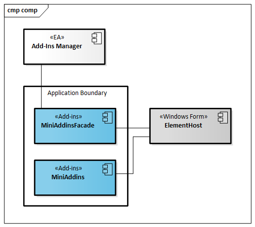
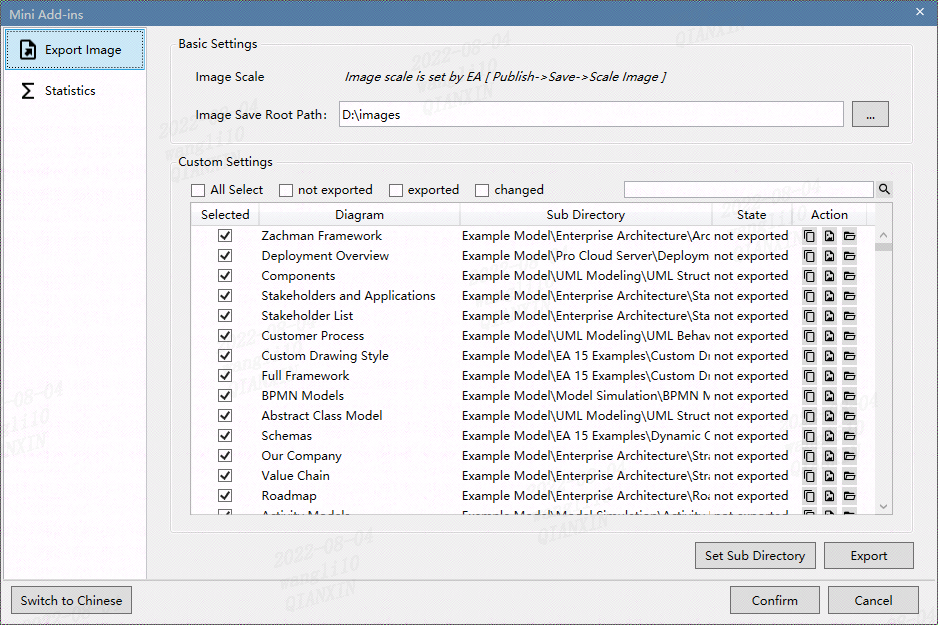
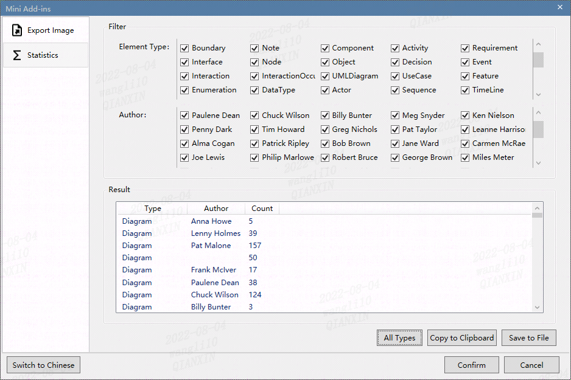
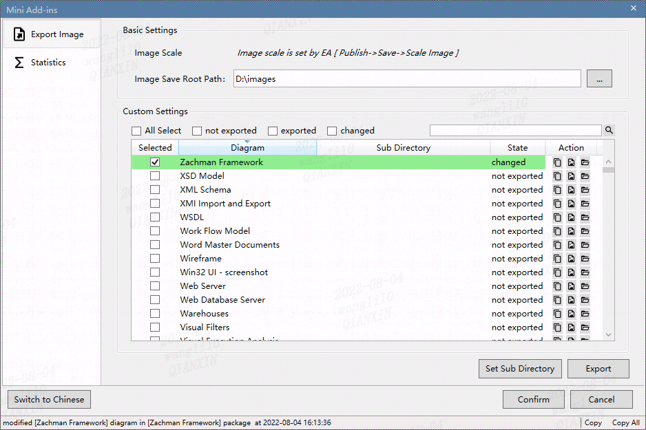
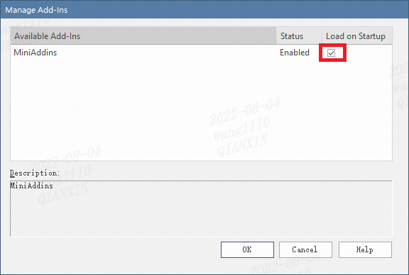
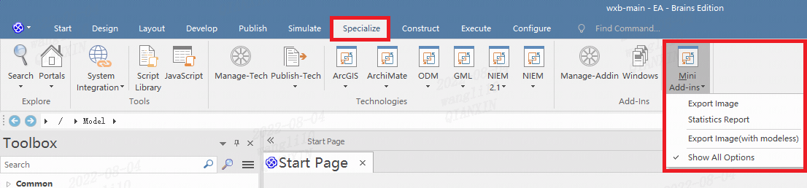

# Enterprise Architect  Mini Add-Ins

本项目利用Enterprise Architect提供的Add-Ins Model、Automation Interface，进行小工具插件开发，主要功能：

- EA图片导出的扩展，支持配置化、个性化保持、一键批量导出
- 模型制作内容的统计


## Overview
因EA仅支持开发语言VB、C#、Delphi进行Add-Ins扩展开发，本项目采用能支持面向对象开发的C#语言进行。其中：
* 用基于Windows Form的MiniAddinsFacade与EA做对接门面，实现与EA之间的交互，作为COM组件注册
* 用基于WPF技术的MiniAddins实现业务处理功能，包含：EA类似画面的定制、MVVM、实现功能等等



## Develope Language and Tool
* C#、.NET Framework 4
* Visual Studio 2017 Community（管理者身份启动）

## Function Description 
### 用例图


### 概要说明
* 配置视角
   - 插件安装配置：插件注册、DLL Com组件注册等，详细见安装方法段落

* 建模工程师视角
  1. 模型Diagram图片导出(export image、save screen display value)
        

  2. 模型制作内容统计(statistics workload)
        

  3. 实时变更监控(export image with modeless)
        
        - 实现机制是订阅EA Model Object的Watcher对象；
        - 在EA中打开另外模型文件时，Add-Ins上的表示内容也将同步刷新；
        - 变更日志反馈到画面底部的状态栏中，可通过点击【Copy】、【Copy All】拷出当次变更点以及全所变更点;
        - **注意：** EA对Diagram模型中的联接线、位置的变更不会产生变更事件，故在此画面中监控不到此类变更
        
  4. 保存画面上设定值(save screen display value) <br/>
     - 点击【Confirm】按钮，保存模型的图片导出状况、导出文件名、路径。再次打开模型时，如已导出的Diagram有改变，则显示“changed”，并且呈现变更背景色。
  
* 其它Key Point
    - 画面支持中英双语切换
    - 点击Cancel按钮时关闭时，将不会保存当次打开后的变化点
    - 支持通过指定Diagram名或Package名进行检索模型图，并且可直接按回车即可执行检索
    - 图片导出配置列表中，Diagram、Sub Directory单元格可点击进行编辑


## Supported
* Enterprise Architect 15.2.1554,15.0
* Windows 10 企业版

## Install

- **首次安装**

  1. 进入document\Add-Ins-Install目录，把dll子目录中如下5个dll文件，拷贝到Enterprise Architect的安装目录(例如：C:\Program Files (x86)\Sparx Systems\EA Trial)

      ```bash
      114,176 Microsoft.WindowsAPICodePack.dll
      587,776 Microsoft.WindowsAPICodePack.Shell.dll
      71,680 MiniAddins.dll
      28,672 MiniAddinsFacade.dll
      39,936 System.Windows.Interactivity.dll
                     5 个文件        842,240 字节
      ```

  2. 用管理者身份运行“Regist DotNet DLL as Com.bat”文件，注册.net dll作为COM组件。在执行之前请确认路径是否正确。

      ``` vbscript
      REM ========================================================================
      REM  Please make sure the path is correct. 
      REM  Change them to your environmnet value if them are incorrent.
      REM  CheckPoint 1: RegAsm.exe Path
      REM  CheckPoint 2: MiniAddinsFacade.dll  Path
      REM ========================================================================
      
      "C:\Windows\Microsoft.NET\Framework\v4.0.30319\RegAsm.exe" "C:\Program Files (x86)\Sparx Systems\EA Trial\MiniAddinsFacade.dll" /silent
      ```

  3. 用管理者身份运行“RegistryEntry_MiniAddins.reg”文件，向注册表登录插件信息。

  4. 打开Enterprise Architect，检查Add-Ins是否安装成功

      - Add-Ins的Stauts是否为Enabled ，并让Check Load On Startup。[Specialize -> Manage Add-Ins]

        

      - 打开模型文件后，插件的菜单项目是否可用
      

- **更新安装**

  只需把**MiniAddins.dll**、**MiniAddinsFacade.dll**进行替换
